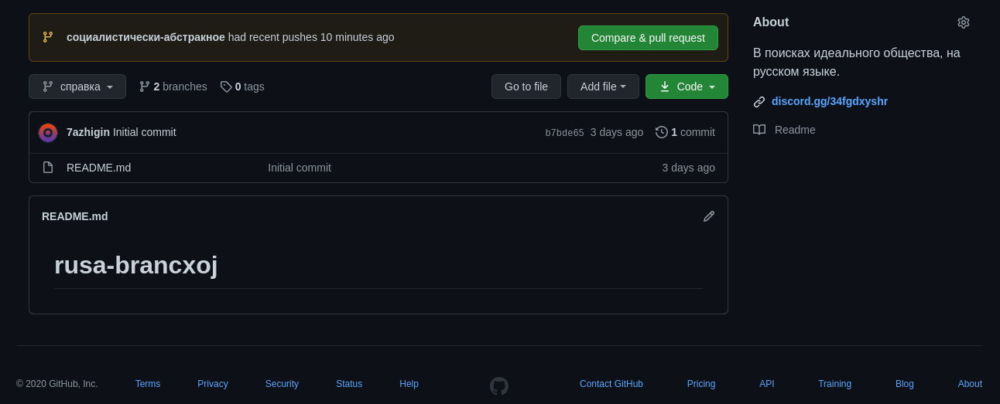

# Справка по работе с ветками

## Что такое ветки?

В нашем случае -- это общества. Общества в файлах markdown(как редактировать это удобно -- в другой главе).

 *Панель с ветками.*

На снимке региона экрана можно увидеть эту самую панель веток. Branches[бранчес] - ветки с английского.

## Как мне редактировать содержимое ветки? Как помочь в развитии "текстового" общества?

### Регистрация на github, для получение возможности отправки заявки на редактирование файлов

1. Заходим на https://github.com/join, проходим регистрацию по инструкциям.

### После регистрирован на github

1. Ищем на интересующую ветку, по названию, либо по содержимому.
    *Как зайти, прочитать.* **Основной документ может иметь другое название, в таком случае он всегда указан в readme.md файле ветки.**

2. Находим спорный, интересующий участок, который вы можете дополнить своими мыслями, либо переписать.
   
   1. Обязательно пишите оглавление, т.е. краткое сообщение мысли.
   2. Обязательно пишите описание мысли, если мысль слишком простая -- можно оставить в описании ссылку на вики. Например "во время палеолит не было велосипеда, [ссылка на википедию]".
3. Нажимаем на отправку commit'а(редактирования), кнопка зелёного цвета.
   1. Ждём принятия редакции модератором, либо копирайтером. Этот процесс займёт не больше 2-ух дней. 

